# Webex Local Tools

Small local-first command-line tools for working with Webex messages.

The tools can:

- call common Webex REST API endpoints
- list room IDs
- search messages over a date range
- optionally use a local Ollama model for semantic relevance
- summarize, classify, or draft replies locally

Message processing can be kept on your machine by using Ollama for language
tasks. Webex API access is handled by Python scripts; the model does not receive
API credentials or tool authority.

## Architecture

```mermaid
flowchart LR
    User["User request"] --> Py["Local Python orchestrator"]

    Py --> Webex["Webex API"]
    Webex --> Raw["Raw Webex messages<br/>text, author, room, message_id"]

    Raw --> Private["Local private store<br/>hit_id -> raw text, author,<br/>room, message_id, local reason"]
    Raw --> Ollama["Local LLM via Ollama<br/>sees raw Webex text locally"]

    Ollama --> Scores["Minimal scoring output<br/>hit_id + score only"]
    Scores --> Handoff["Cloud-safe handoff<br/>run_id, hit_id, score, rank_hint"]

    Handoff --> Claude["Headless parser<br/>cloud LLM / Claude<br/>NO raw Webex text"]
    Claude --> Selected["Selected hit_ids only"]

    Selected --> Renderer["Local renderer"]
    Private --> Renderer
    Renderer --> UserResult["User-visible result<br/>raw text + author + reason<br/>rendered locally"]

    classDef sensitive fill:#ffe5e5,stroke:#cc0000,color:#111;
    classDef safe fill:#e8f5ff,stroke:#0066aa,color:#111;
    classDef local fill:#e8ffe8,stroke:#228833,color:#111;

    class Raw,Private,UserResult sensitive;
    class Handoff,Scores,Selected safe;
    class Py,Ollama,Renderer local;
```



Sensitive Webex data stays in the local path. The cloud parser receives only
opaque IDs and scores, so it can sort or select hits without seeing message
content, authors, room names, Webex message IDs, or local reasons.

## Requirements

- Python 3.10+
- A Webex access token
- Optional: Ollama for semantic search and local message processing

No third-party Python packages are required.

## Setup

Set a Webex token in your shell:

```bash
export WEBEX_ACCESS_TOKEN='...'
```

Or save it to `.env`:

```bash
python3 scripts/setup_webex_token.py
```

The setup script opens the Webex personal access token documentation, reads the
token from standard input, and saves `WEBEX_ACCESS_TOKEN` to `.env`.

Verify access:

```bash
python3 scripts/webex_api.py me
```

If you use Ollama:

```bash
export OLLAMA_MODEL='qwen3.5:4b'
```

## Basic Webex Commands

```bash
python3 scripts/webex_api.py rooms list --type group --max 20
python3 scripts/list_webex_rooms.py --type group --max 100
python3 scripts/webex_api.py messages list --room-id ROOM_ID --max 20
python3 scripts/webex_api.py messages send --room-id ROOM_ID --text "Hello from the API"
python3 scripts/webex_api.py people search --email person@example.com
```

## Search Messages

Search all accessible rooms from the last 30 days:

```bash
python3 scripts/search_webex_messages.py "open follow-up items"
```

Search the last 7 days:

```bash
python3 scripts/search_webex_messages.py "topics for next weekly meeting" --days 7
```

Search a specific date range:

```bash
python3 scripts/search_webex_messages.py "release planning" --start 2026-05-01 --end 2026-06-01
```

Search one room:

```bash
python3 scripts/search_webex_messages.py "review schedule" --room-id ROOM_ID --days 7
```

Search direct messages and one named room:

```bash
python3 scripts/search_webex_messages.py \
  "topics for next weekly meeting" \
  --include-direct \
  --room-title "Team Updates" \
  --semantic \
  --model qwen3.5:4b
```

Use local Ollama for semantic relevance:

```bash
python3 scripts/search_webex_messages.py \
  "action items from recent discussion" \
  --semantic \
  --model qwen3.5:4b
```

Tune semantic search when Ollama is slow:

```bash
python3 scripts/search_webex_messages.py \
  "topics for next weekly meeting" \
  --semantic \
  --semantic-candidates 20 \
  --semantic-batch-size 5 \
  --model qwen3.5:4b
```

Inspect all semantic matches even when scores are low:

```bash
python3 scripts/search_webex_messages.py \
  "topics for next weekly meeting" \
  --days 7 \
  --room-title "Team Updates" \
  --semantic \
  --min-score 0 \
  --model qwen3.5:4b
```

Use a local keyword prefilter before semantic search:

```bash
python3 scripts/search_webex_messages.py \
  "database incident follow-up" \
  --keyword database \
  --keyword incident \
  --semantic
```

By default, search results print the author and full raw message text. Hide text
when needed:

```bash
python3 scripts/search_webex_messages.py "sensitive request" --semantic --hide-text --json
```

Limit text length:

```bash
python3 scripts/search_webex_messages.py \
  "topics for next weekly meeting" \
  --semantic \
  --snippet-chars 300
```

## Local Ollama Agent

Use `scripts/webex_ollama_agent.py` to process recent Webex messages with a local
Ollama model.

```bash
export WEBEX_ROOM_ID='...'
export OLLAMA_MODEL='qwen3.5:4b'

python3 scripts/webex_ollama_agent.py --mode summarize --include-seen
python3 scripts/webex_ollama_agent.py --mode reply --include-seen
python3 scripts/webex_ollama_agent.py --mode classify --include-seen
```

Continuous polling:

```bash
python3 scripts/webex_ollama_agent.py --watch --interval 60 --ignore-self
```

The agent prints results by default. Add `--send` only when you intentionally
want to post generated output back to Webex.

## Privacy-Preserving Handoff Workflow

`scripts/safe_webex_search.py` orchestrates a safer workflow for cases where a
cloud parser is allowed to see only non-sensitive metadata.

It writes two artifacts:

- private store: raw text, author, room, message IDs, and local reasons
- cloud-safe handoff: `run_id`, `hit_id`, `score`, and `rank_hint` only

Run local Webex fetch + local Ollama scoring and render locally:

```bash
python3 scripts/safe_webex_search.py \
  "topics for next weekly meeting" \
  --days 7 \
  --room-title "Team Updates" \
  --model qwen3.5:4b
```

Create artifacts without rendering raw text:

```bash
python3 scripts/safe_webex_search.py \
  "topics for next weekly meeting" \
  --days 7 \
  --room-title "Team Updates" \
  --model qwen3.5:4b \
  --handoff-out /tmp/webex-handoff.json \
  --private-store /tmp/webex-private.json \
  --no-render
```

Give only `/tmp/webex-handoff.json` to a cloud parser. It should return a file
like:

```json
{
  "run_id": "run_...",
  "selected_hit_ids": ["h_0001", "h_0002"]
}
```

Render selected hits locally:

```bash
python3 scripts/render_webex_hits.py \
  --private-store /tmp/webex-private.json \
  --selected-hits /tmp/webex-selected.json
```

You can also let `safe_webex_search.py` call a headless parser command. The
command receives only a prompt pointing to the cloud-safe handoff file:

```bash
python3 scripts/safe_webex_search.py \
  "topics for next weekly meeting" \
  --days 7 \
  --room-title "Team Updates" \
  --model qwen3.5:4b \
  --headless-cmd "claude -p --tools '' --output-format text" \
  --headless-limit 5
```

Do not pass the private store to a cloud parser.

## Local Contract Tests

Validate the local output contract without calling Webex:

```bash
python3 scripts/simulate_agent_contract.py
```

Test the contract with a real local Ollama model and fake Webex outputs:

```bash
python3 scripts/test_ollama_contract.py --model qwen3.5:4b --json-mode
```

This test calls Ollama only. It does not call Webex.

## Safety Notes

- Do not commit access tokens.
- Keep `.env`, state files, local databases, and caches out of git.
- Use `--send` only after reviewing generated output.
- Search and summarize locally when message content is sensitive.
